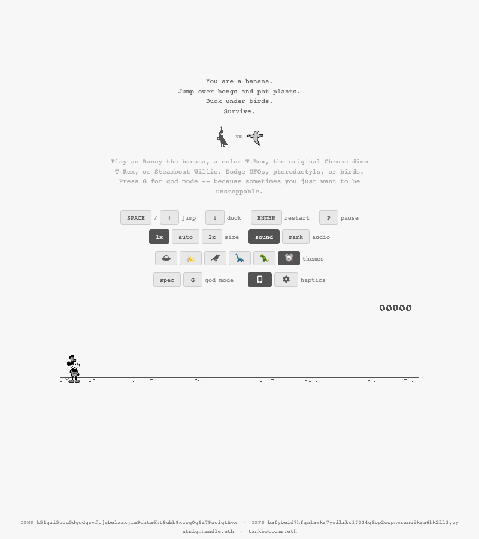

# atsignhandle.xyz

A Chrome dino-style endless runner starring Banny the banana, deployed on Cloudflare Workers and pinned to IPFS/IPNS.



## Features

- **6 Themes** -- UFO, Pterodactyl, Birds, Color T-Rex, Original T-Rex, and Steamboat Willie, each with unique sprites
- **God mode** -- Toggle invincibility with the G key; speed control via mod menu
- **High score persistence** -- Best score saved to localStorage across sessions
- **Haptic feedback** -- iOS (checkbox switch toggle) and Android (navigator.vibrate with PWM modulation), configurable per game event with custom pattern builder
- **Mobile touch controls** -- Jump, pause, and crouch buttons for touchscreen devices; two-finger touch to duck
- **Sprite badge cycling** -- Animated preview cycling through all theme hero/villain pairs on page load
- **Sound toggle** with custom audio support
- **Safari / iOS audio** -- AudioContext resume on user gesture, silent WAV trick for speaker output routing
- **Resolution control** (1x / 2x / auto) for pixel-perfect rendering; 2x restricted to themes with real 2x sprites
- **Pause system** -- Desktop overlay (P key or click) and mobile pause button with play/pause icon toggle
- **Dynamic game description** updates based on active theme (character name + obstacle name)
- **Tooltips** with touch support for mobile
- **Font Awesome icons** for UI controls
- **Decentralized hosting** via IPFS and IPNS

## Sprite Sheets

### Banny (UFO theme)


### Steamboat Willie


## Tech Stack

- **Cloudflare Workers** with static asset serving
- **TypeScript** worker entry point
- **Vanilla JS** game engine (no framework dependencies)
- **IPFS / IPNS** for decentralized pinning
- **Font Awesome 6** for iconography

## Getting Started

```bash
# Clone
git clone https://github.com/tankbottoms/atsignhandle.xyz.git
cd atsignhandle.xyz

# Install dependencies
bun install

# Start dev server
npx wrangler dev --ip 0.0.0.0

# Deploy to Cloudflare
bun run deploy
```

## Game Controls

### Desktop

| Key | Action |
|-----|--------|
| SPACE / UP | Jump |
| DOWN | Duck |
| ENTER | Restart |
| P | Pause / Resume |
| G | Toggle god mode |

### Mobile

| Button | Action |
|--------|--------|
| J (right) | Jump |
| Pause (center) | Pause / Resume |
| Arrow down (left) | Crouch / Speed drop |
| Two-finger touch | Duck |

## Themes

| Theme | Character | Obstacles | Sprite Sheet | 2x |
|-------|-----------|-----------|:------------:|:--:|
| UFO | Banny | Bongs, pot plants, UFOs |  | Yes |
| Pterodactyl | Banny | Bongs, pot plants, pterodactyls |  | No |
| Birds | Banny | Bongs, pot plants, birds |  | No |
| Color T-Rex | T-Rex | Cacti, pterodactyls |  | No |
| Original T-Rex | T-Rex | Cacti, pterodactyls |  | No |
| Steamboat Willie | Willie | Bongs, pot plants, birds |  | No |

## Deployment

See [docs/deploy.md](docs/deploy.md) for the full deployment workflow.

### Quick deploy

```bash
# IPFS
~/Developer/bun-ipfs/bun-ipfs public --no-qr

# Cloudflare
bun run deploy
```

Serves at [atsignhandle.xyz](https://atsignhandle.xyz) and [www.atsignhandle.xyz](https://www.atsignhandle.xyz).

A detailed breakdown of all sprite sheet assets, pixel positions, dimensions, and usage context is available at [/spec](https://atsignhandle.xyz/spec).

## Links

- **Live:** [atsignhandle.xyz](https://atsignhandle.xyz)
- **ENS:** [atsignhandle.eth.limo](https://atsignhandle.eth.limo)
- **IPFS:** [bafybeibo3jaenyc4oeu5k6dux62spt4mhwzzlv5ys5mqoyad7ts7vlhehi](https://ipfs.io/ipfs/bafybeibo3jaenyc4oeu5k6dux62spt4mhwzzlv5ys5mqoyad7ts7vlhehi/)
- **IPNS:** `k51qzi5uqu5dgodqsvftjebelxaxjia9chta6ht9ubb9xzwg0g6a79zciqthyx`

## License

[MIT](LICENSE)
